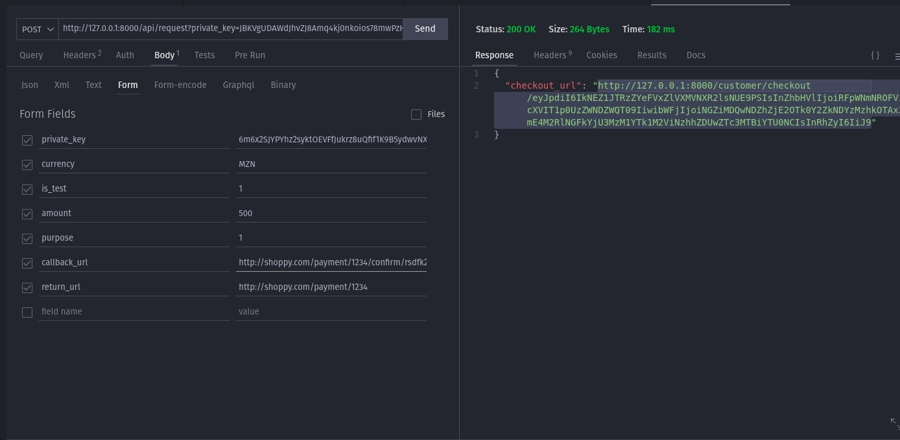
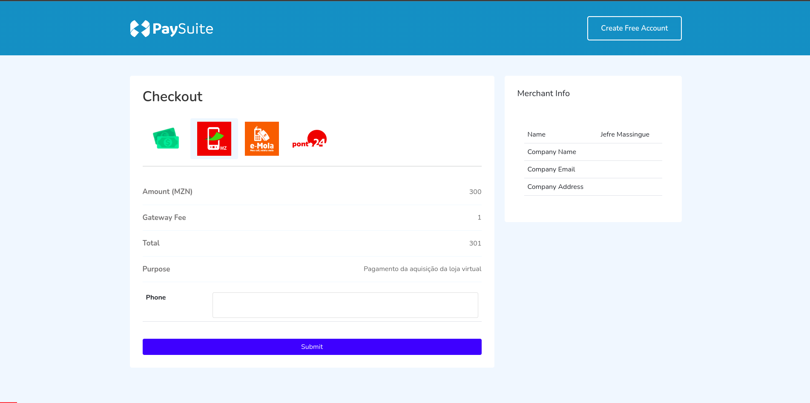
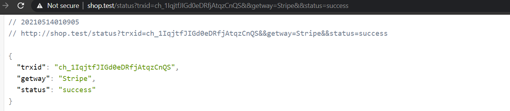
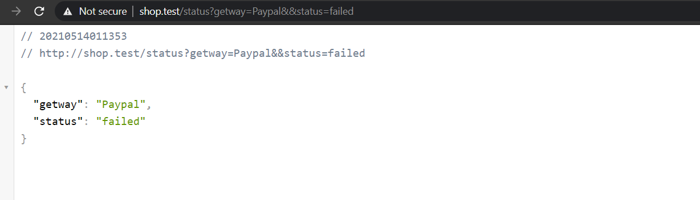

# Payments through API


##  Generate Checkout Link For Make Payment

To generate the checkout link for make payment, send POST request to following URL:

```txt
https://paysuite.co.mz/api/request
```


## Headers   
| Key         | Value            |
| ----------  | ---------------- |
|Accept       |	`application/json` |
|Content-Type | `application/json` |


## Request Body
In body create JSON object with private_key,currency,url,is_test,amount as key and their values from the credentials of merchant profile.

| Key            |        Value                           |
| -------------- | ---------------------------------------|
| private_key	 | Merchant_private_key                   |
| currency       | Merchant_currency                      |
| callback_url	 | http://domain.com/api/confirm/reference |
| return_url:    | http://domain.com/product/1234/payment The status parameter will be added on return. `status=success`  `status=error`  |   
| is_test	     | Accept(1 OR 0) 1 = Sandbox Mode 0 = Live Mode |
| amount	     | 100                                    |
| purpose        |	testing purpose                       |


The callback will be sent by the server in background with parameters:
```javascript
{
    payment_id: integer,
    amount: number,
    main_amount: number,
    currency: string,
    trxid: string,
    status: string (success),
    gateway_name:string,
    metadata: array ( eg: payment metadata, phone, reference, entity, comment)
    
}
```




Checkout Page:




Success Response:




Failed:




Full Documentation:

[https://paysuite.co.mz/api/documentation](https://paysuite.co.mz/api/documentation)