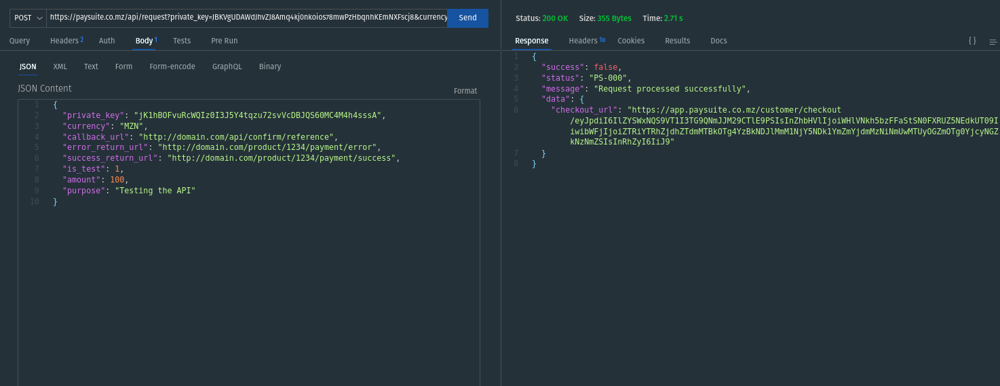

# Payments through API

## Generate Checkout Link For Make Payment

To generate the checkout link for make payment, send POST request to following URL:

```txt
https://paysuite.co.mz/api/request
```

## Headers

| Key          | Value              |
| ------------ | ------------------ |
| Accept       | `application/json` |
| Content-Type | `application/json` |

## Request Body

<!-- In body create JSON object with private_key,currency,url,is_test,amount as key and their values from the credentials of merchant profile. -->

To create the request body, use a JSON object with the following key-value pairs and their corresponding values from the merchant profile credentials:

<!-- | Key                 | Value                                          |
| ------------------- | ---------------------------------------------- |
| private_key         | Merchant_private_key                           |
| currency            | Merchant_currency                              |
| callback_url        | http://domain.com/api/confirm/reference        |
| error_return_url:   | http://domain.com/product/1234/payment/error   |
| success_return_url: | http://domain.com/product/1234/payment/success |
| is_test             | Accept(1 OR 0) 1 = Sandbox Mode 0 = Live Mode  |
| amount              | 100                                            |
| purpose             | testing purpose                                | -->

| Key                | Description                                                                             | Required | Example                                          |
| ------------------ | --------------------------------------------------------------------------------------- | -------- | ------------------------------------------------ |
| private_key        | The private key of the merchant profile (with 50 characters)                            | Yes      | "abcdef1234567890...xyz"                         |
| currency           | The currency used for the transaction (default: MZN)                                    | No       | "MZN"                                            |
| callback_url       | The URL where the confirmation will be sent through a POST request (background process) | No       | "http://domain.com/api/confirm/reference"        |
| error_return_url   | The URL for handling failed payments                                                    | No       | "http://domain.com/product/1234/payment/error"   |
| success_return_url | The URL for handling successful payments                                                | No       | "http://domain.com/product/1234/payment/success" |
| is_test            | Flag indicating whether it's a test or live mode (1 = Sandbox Mode, 0 = Live Mode)      | Yes      | 1                                                |
| amount             | The amount of the transaction ( > 0 )                                                   | No       | 100                                              |
| purpose            | The purpose or description of the transaction                                           | Yes      | "Testing the API"                                |

**The callback will be sent by the server in background with parameters:**

```javascript
{
    payment_id: integer,
    amount: number,
    main_amount: number,
    currency: string,
    trxid: string,
    status: string (success),
    gateway_name:string,
    metadata: array ( eg: payment metadata, phone, reference, entity, comment)

}
```

Example JSON object for the request body:

```json
{
  "private_key": "abcdef1234567890...xyz",
  "currency": "MZN",
  "callback_url": "http://domain.com/api/confirm/reference",
  "error_return_url": "http://domain.com/product/1234/payment/error",
  "success_return_url": "http://domain.com/product/1234/payment/success",
  "is_test": 1,
  "amount": 100,
  "purpose": "Testing the API"
}
```



Checkout Page:


Success Response:


Failed:


Full Documentation:

[https://paysuite.co.mz/api/documentation](https://paysuite.co.mz/api/documentation)

## API Responses

The status code of a response indicates the success or failure of the request. The following status codes are possible:

| HTTP Status Code | Code   | Message                         |
| ---------------- | ------ | ------------------------------- |
| 200              | PS-001 | Request processed successfully  |
| 500              | PS-002 | Internal Error                  |
| 401              | PS-003 | Invalid API Key                 |
| 401              | PS-004 | User is not active              |
| 422              | PS-005 | Invalid Parameters              |
| 401              | PS-006 | Daily Request Limit Exceeded!   |
| 401              | PS-007 | Monthly Request Limit Exceeded! |
| 401              | PS-008 | Invalid Currency                |

### Response structure

The response structure for both error and success responses is the same:

```json
{
  "success": true|false,
  "status": "PS-XXXX",
  "message": "Response error message"
  "data": {}
}
```

The `success` property indicates whether the request was successful. If the request was successful, the `status` property will be `PS-0001` and the `message` property will be a success message. If the request was not successful, the `status` property will be an error code and the `message` property will be an error message.

The `data` property is only present in success responses. It contains the data that was returned by the API. The data structure will vary depending on the API endpoint that was called.

Here are some examples of error and success responses:

**Error response**

```json
{
  "success": false,
  "status": "PS-003",
  "message": "Invalid API Key"
}
```

**Success response**

```json
{
  "success": true,
  "status": "PS-0001",
  "message": "Payment created successfully",
  "data": {
    "checkout_url": "https://paysuite.co.mz/customer/checkout/eyJpdiI6IjRXUnBVcWVsUzBpcHU3bC9ZQWNlV0E9PSIsInZhbHVlIjoiTmdkaDBzUUNtSUowSENQVzRmR3RCUT09IiwibWFjIjoiNWUzOTZlM2U4ZDk1MTZkY2Y4MGUyY2ZlZGIwNzc0MmYwY2IyM2NjNzdmODUzMWQ4OWY2M2QxZDdjNjEwODZkNCIsInRhZyI6IiJ9"
  }
}
```

### Additional information

The following additional information may be helpful:

- The PaySuite API uses the JSON format for all responses.
- The PaySuite API uses HTTP status codes to indicate the success or failure of a request.
- The PaySuite API uses the `success` property to indicate whether a request was successful.
- The PaySuite API uses the `status` property to indicate the status code of a response.
- The PaySuite API uses the `message` property to provide additional information about the status of a response.
- The PaySuite API uses the `data` property to return data from a successful request.
