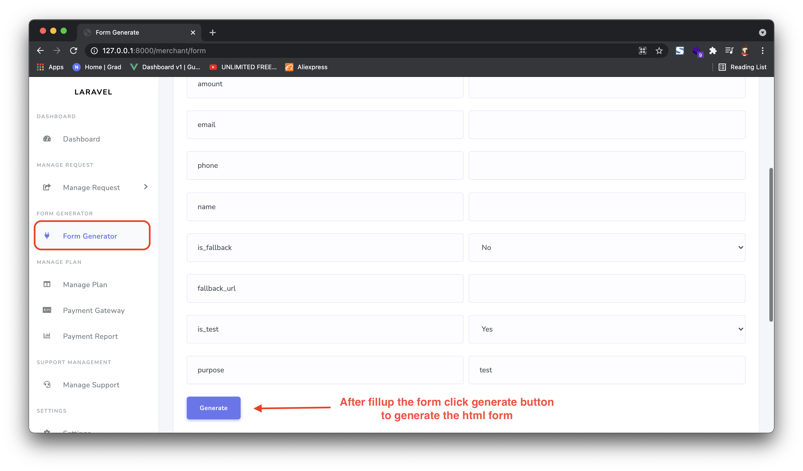
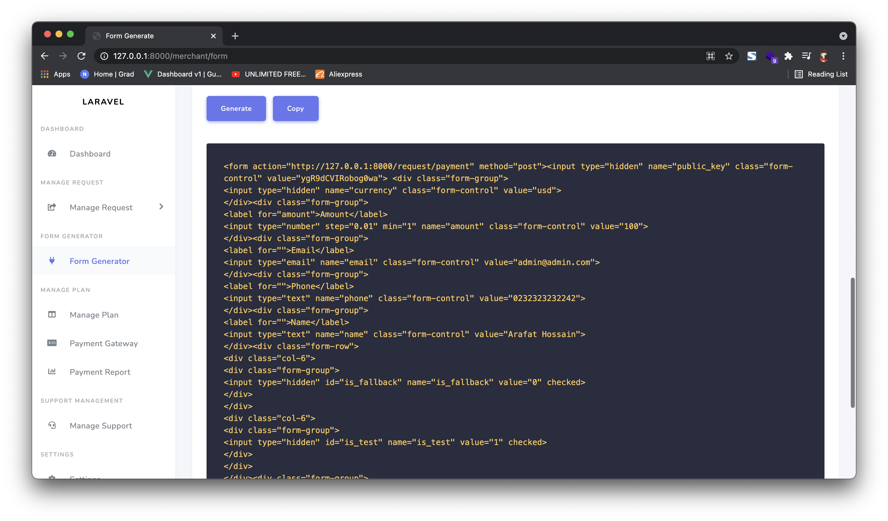
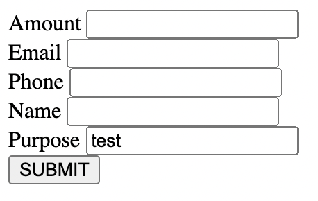
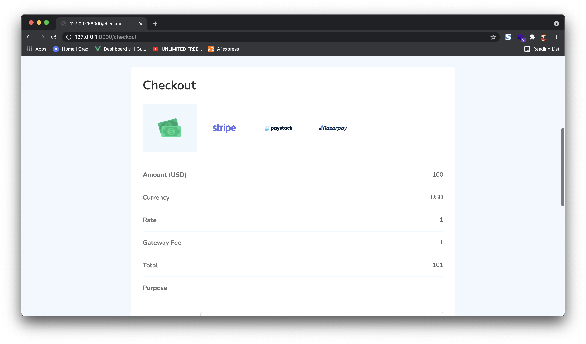
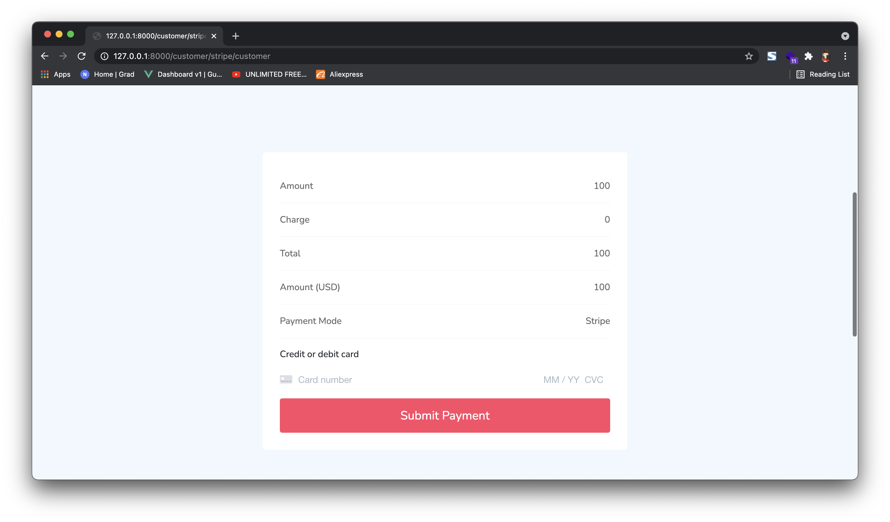
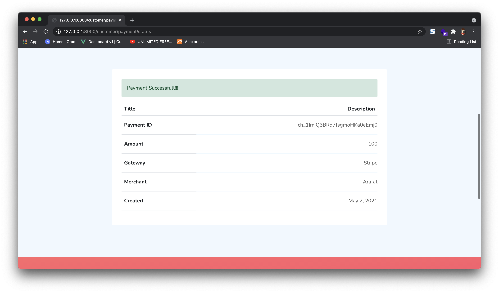

# Payment Form
Payments through Merchant Generated form.
To create the html form for users click form generator from the side menu then fill up the desired values if necessary. Then click on generate button.

Step 1: Go to `https://paysuite.co.mz/merchant/form`

Step 2: Now you can click copy to copy the html code and use it on your project html file.

Step 3: Now user can fillup the form and submit.

Step 4: After submit select the payment gateway.

Step 5: Enter your credit card info if it requires.

Step 5: If payment is successful you will be redirected to success page or if merchant added the fallback url then you will be redirected to desired website:
