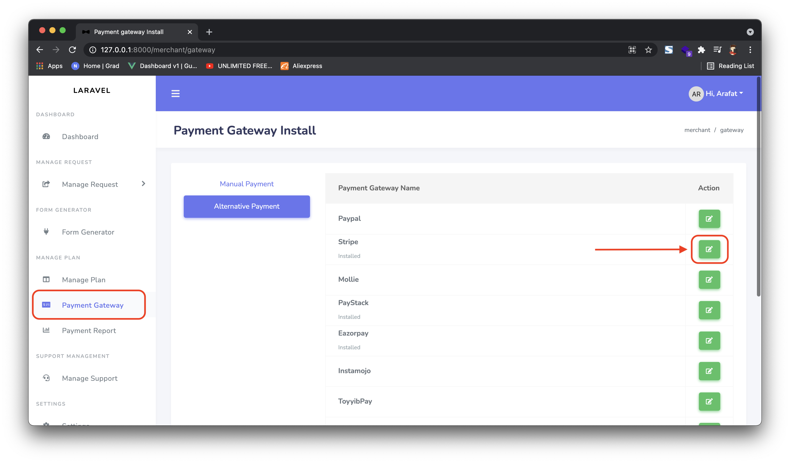
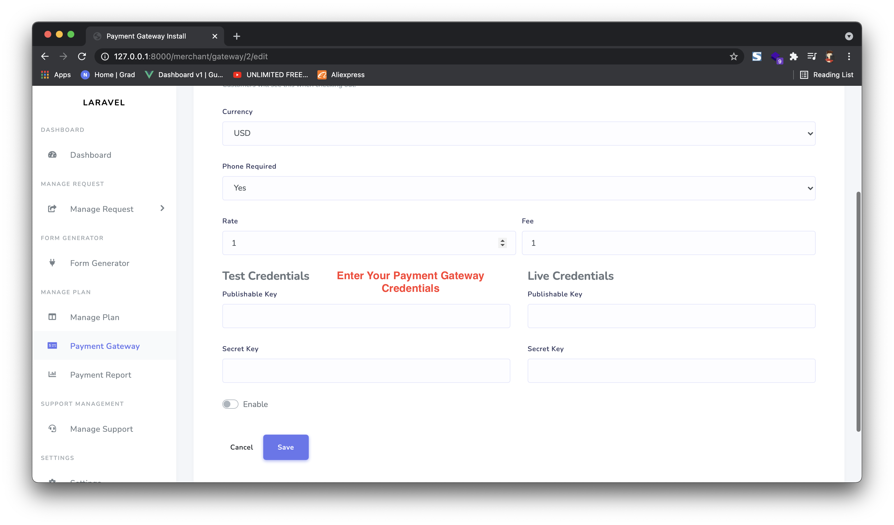

# Payment gateway Install

You can install your own payment gateway in Merchant Panel. Just follow two step for this. Go to: `https://paysuite.co.mz/merchant/gateway`.

## Select payment gateway to install with your credentials.

## Enter your gateway information including credentials:

