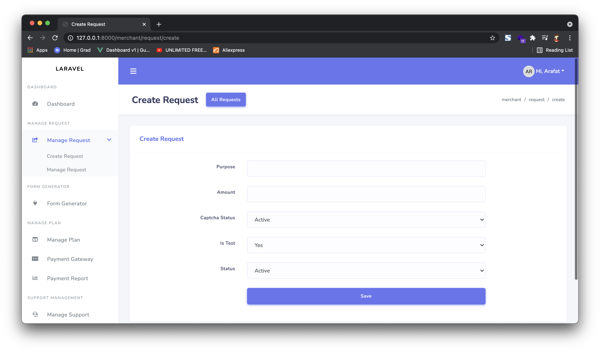
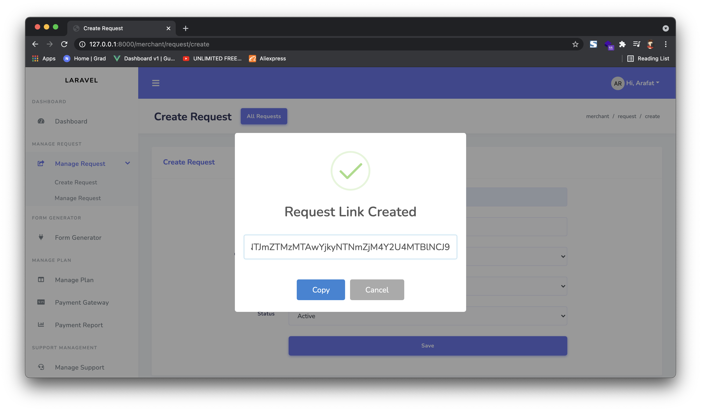

# Payment Link

Payments through one time URL (Merchant Generated)

## Create request

To create a new request select create request and fillup the form a new url will be generated.

## Send Link

Now copy the link and send it to your customer. Customer will view the payment gateway options.

Rest of the process is same as html form.

